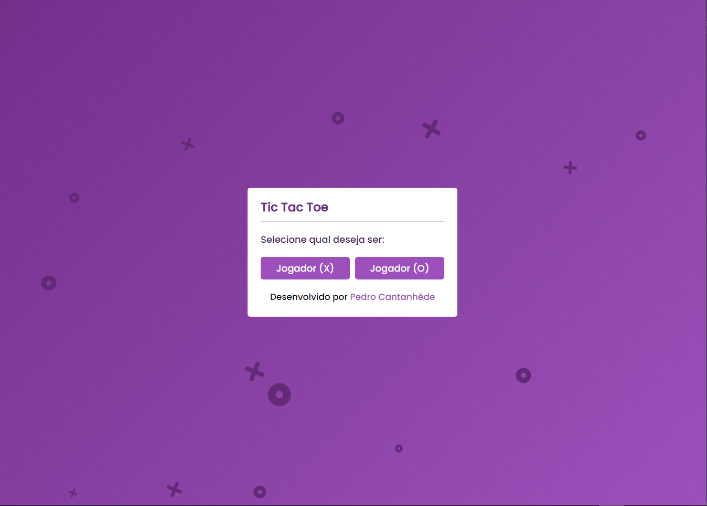
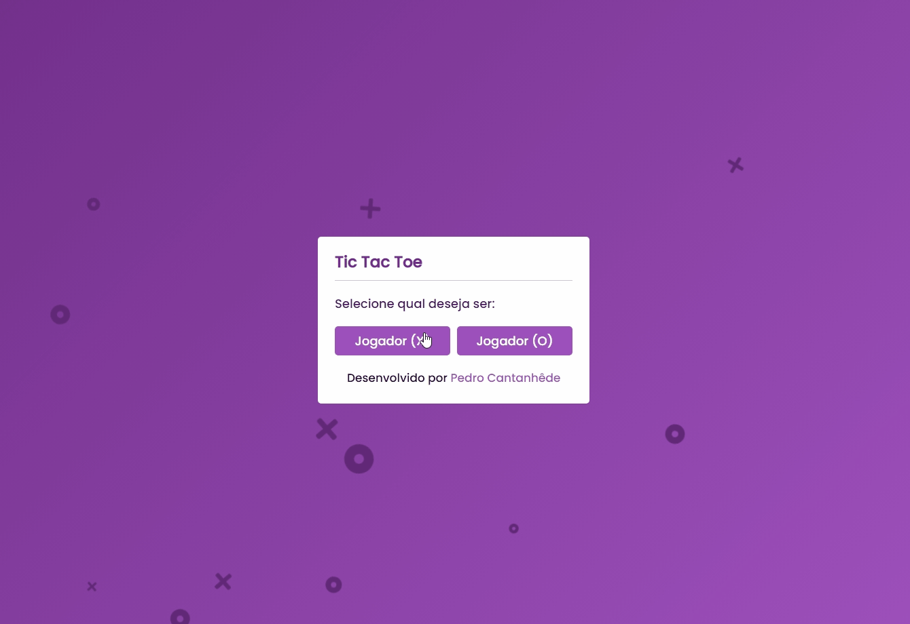
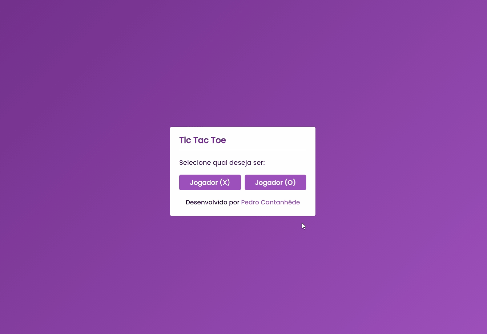
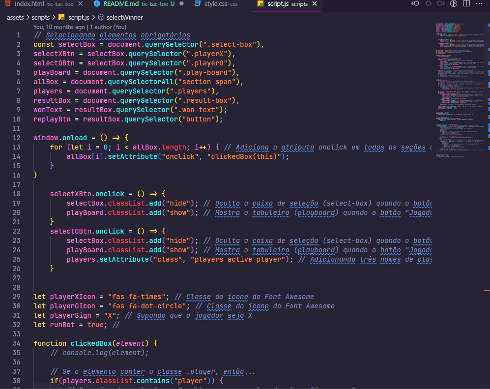

<h1 align="center">
    
</h1>

    <h3> 🟣 Venha se divertir com o tradicional tic-tac-toe! 🟣 </h3>
    
     
    

## TIC-TAC-TOE

Projeto pessoal com o intuito de elaborar o tradicional jogo da velha utilizando JavaScript.

  

## 🛠️ Tecnologias

💻 HTML

💻 CSS

💻 JavaScript

## :camera: Veja:

### 🖥️ Desktop

### ☑️ Código:

## 🌟 Curso Desenvolvimento Web Full Stack

Deixo minha recomendação ao curso do **IGOR OLIVEIRA**. Tenho aprendido muito nessas últimas semanas e o curso tem sido fundamental para o meu aprendizado.

